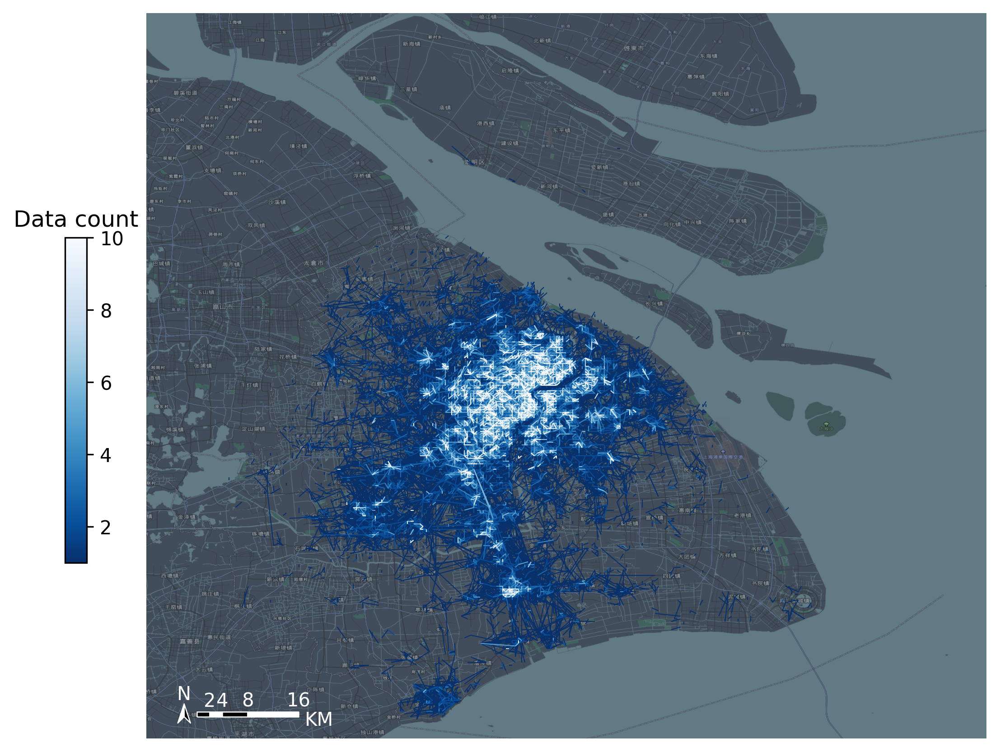
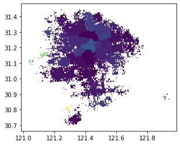
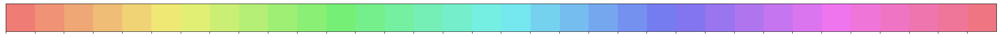
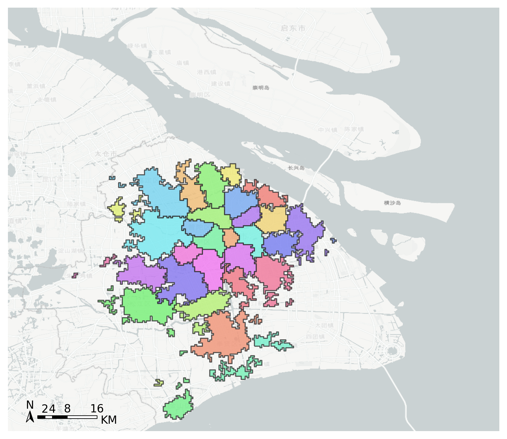

Community detection for bicycle-sharing demand
======================================================

| Jupyter notebook for this example: `Here <https://github.com/ni1o1/transbigdata/blob/main/example/Example%205-community%20detection%20for%20bikesharing%20data.ipynb>`__.

| For bicycle sharing demand, each trip of can be seen as a process from the starting loaction to the end loaction. When we regard the start point and the end point as nodes, and the travel between them as edges, a network can be constructed. By analysing this network, we can get information about the spatial connection structure of the city or the macro travel characteristics of the bicycle sharing demand.

| Community detection, also called graph partition, helps us to reveal the hidden relations among the nodes in the network. In this example, we will introduce how to integrate `TransBigData` into the analysis process of community detection from bicycle-sharing data. 

Data preprocessing
-------------------------

Fristly, import packages.

::

    import pandas as pd
    import numpy as np
    import geopandas as gpd
    import transbigdata as tbd

Read bicycle sharing data

::

    bikedata = pd.read_csv(r'data/bikedata-sample.csv')
    bikedata.head(5)

.. raw:: html

    

    
    <table border="1" class="dataframe">
      <thead>
        <tr style="text-align: right;">
          <th></th>
          <th>BIKE_ID</th>
          <th>DATA_TIME</th>
          <th>LOCK_STATUS</th>
          <th>LONGITUDE</th>
          <th>LATITUDE</th>
        </tr>
      </thead>
      <tbody>
        <tr>
          <th>0</th>
          <td>5</td>
          <td>2018-09-01 0:00:36</td>
          <td>1</td>
          <td>121.363566</td>
          <td>31.259615</td>
        </tr>
        <tr>
          <th>1</th>
          <td>6</td>
          <td>2018-09-01 0:00:50</td>
          <td>0</td>
          <td>121.406226</td>
          <td>31.214436</td>
        </tr>
        <tr>
          <th>2</th>
          <td>6</td>
          <td>2018-09-01 0:03:01</td>
          <td>1</td>
          <td>121.409402</td>
          <td>31.215259</td>
        </tr>
        <tr>
          <th>3</th>
          <td>6</td>
          <td>2018-09-01 0:24:53</td>
          <td>0</td>
          <td>121.409228</td>
          <td>31.214427</td>
        </tr>
        <tr>
          <th>4</th>
          <td>6</td>
          <td>2018-09-01 0:26:38</td>
          <td>1</td>
          <td>121.409771</td>
          <td>31.214406</td>
        </tr>
      </tbody>
    </table>
    

| 
| Read the polygon of the study area and delete the data outside of the study area

::

    shanghai_admin = gpd.read_file(r'data/shanghai.json')
    bikedata = tbd.clean_outofshape(bikedata, shanghai_admin, col=['LONGITUDE', 'LATITUDE'], accuracy=500)

Identify Bicycle sharing trip information using ``tbd.bikedata_to_od``

::

    move_data,stop_data = tbd.bikedata_to_od(bikedata,
                       col = ['BIKE_ID','DATA_TIME','LONGITUDE','LATITUDE','LOCK_STATUS'])
    move_data.head(5)

.. raw:: html

    

    
    <table border="1" class="dataframe">
      <thead>
        <tr style="text-align: right;">
          <th></th>
          <th>BIKE_ID</th>
          <th>stime</th>
          <th>slon</th>
          <th>slat</th>
          <th>etime</th>
          <th>elon</th>
          <th>elat</th>
        </tr>
      </thead>
      <tbody>
        <tr>
          <th>96</th>
          <td>6</td>
          <td>2018-09-01 0:00:50</td>
          <td>121.406226</td>
          <td>31.214436</td>
          <td>2018-09-01 0:03:01</td>
          <td>121.409402</td>
          <td>31.215259</td>
        </tr>
        <tr>
          <th>561</th>
          <td>6</td>
          <td>2018-09-01 0:24:53</td>
          <td>121.409228</td>
          <td>31.214427</td>
          <td>2018-09-01 0:26:38</td>
          <td>121.409771</td>
          <td>31.214406</td>
        </tr>
        <tr>
          <th>564</th>
          <td>6</td>
          <td>2018-09-01 0:50:16</td>
          <td>121.409727</td>
          <td>31.214403</td>
          <td>2018-09-01 0:52:14</td>
          <td>121.412610</td>
          <td>31.214905</td>
        </tr>
        <tr>
          <th>784</th>
          <td>6</td>
          <td>2018-09-01 0:53:38</td>
          <td>121.413333</td>
          <td>31.214951</td>
          <td>2018-09-01 0:55:38</td>
          <td>121.412656</td>
          <td>31.217051</td>
        </tr>
        <tr>
          <th>1028</th>
          <td>6</td>
          <td>2018-09-01 11:35:01</td>
          <td>121.419261</td>
          <td>31.213414</td>
          <td>2018-09-01 11:35:13</td>
          <td>121.419518</td>
          <td>31.213657</td>
        </tr>
      </tbody>
    </table>
    

| 
| Calculate the travel distance. Remove too long and too short trips.

::

    move_data['distance'] = tbd.getdistance(move_data['slon'],move_data['slat'],move_data['elon'],move_data['elat'])
    move_data = move_data[(move_data['distance']>100)&(move_data['distance']<10000)]

Perform data gridding:

::

    bounds = (120.85, 30.67, 122.24, 31.87)
    params = tbd.grid_params(bounds,accuracy = 500)
    #Aggregate OD data
    od_gdf = tbd.odagg_grid(move_data, params, col=['slon', 'slat', 'elon', 'elat'])
    od_gdf.head(5)

.. raw:: html

    

    
    <table border="1" class="dataframe">
      <thead>
        <tr style="text-align: right;">
          <th></th>
          <th>SLONCOL</th>
          <th>SLATCOL</th>
          <th>ELONCOL</th>
          <th>ELATCOL</th>
          <th>count</th>
          <th>SHBLON</th>
          <th>SHBLAT</th>
          <th>EHBLON</th>
          <th>EHBLAT</th>
          <th>geometry</th>
        </tr>
      </thead>
      <tbody>
        <tr>
          <th>0</th>
          <td>26</td>
          <td>95</td>
          <td>26</td>
          <td>96</td>
          <td>1</td>
          <td>120.986782</td>
          <td>31.097177</td>
          <td>120.986782</td>
          <td>31.101674</td>
          <td>LINESTRING (120.98678 31.09718, 120.98678 31.1...</td>
        </tr>
        <tr>
          <th>40803</th>
          <td>117</td>
          <td>129</td>
          <td>116</td>
          <td>127</td>
          <td>1</td>
          <td>121.465519</td>
          <td>31.250062</td>
          <td>121.460258</td>
          <td>31.241069</td>
          <td>LINESTRING (121.46552 31.25006, 121.46026 31.2...</td>
        </tr>
        <tr>
          <th>40807</th>
          <td>117</td>
          <td>129</td>
          <td>117</td>
          <td>128</td>
          <td>1</td>
          <td>121.465519</td>
          <td>31.250062</td>
          <td>121.465519</td>
          <td>31.245565</td>
          <td>LINESTRING (121.46552 31.25006, 121.46552 31.2...</td>
        </tr>
        <tr>
          <th>40810</th>
          <td>117</td>
          <td>129</td>
          <td>117</td>
          <td>131</td>
          <td>1</td>
          <td>121.465519</td>
          <td>31.250062</td>
          <td>121.465519</td>
          <td>31.259055</td>
          <td>LINESTRING (121.46552 31.25006, 121.46552 31.2...</td>
        </tr>
        <tr>
          <th>40811</th>
          <td>117</td>
          <td>129</td>
          <td>118</td>
          <td>126</td>
          <td>1</td>
          <td>121.465519</td>
          <td>31.250062</td>
          <td>121.470780</td>
          <td>31.236572</td>
          <td>LINESTRING (121.46552 31.25006, 121.47078 31.2...</td>
        </tr>
      </tbody>
    </table>
    

| 
| Visualize figure.

::

    #Create figure
    import matplotlib.pyplot as plt
    import plot_map
    fig =plt.figure(1,(8,8),dpi=300)
    ax =plt.subplot(111)
    plt.sca(ax)
    #Load basemap
    tbd.plot_map(plt,bounds,zoom = 11,style = 8)
    #Plot colorbar
    cax = plt.axes([0.05, 0.33, 0.02, 0.3])
    plt.title('Data count')
    plt.sca(ax)
    #Plot OD
    od_gdf.plot(ax = ax,column = 'count',cmap = 'Blues_r',linewidth = 0.5,vmax = 10,cax = cax,legend = True)
    #Plot compass and scale
    tbd.plotscale(ax,bounds = bounds,textsize = 10,compasssize = 1,textcolor = 'white',accuracy = 2000,rect = [0.06,0.03],zorder = 10)
    plt.axis('off')
    plt.xlim(bounds[0],bounds[2])
    plt.ylim(bounds[1],bounds[3])
    plt.show()

Extract node data
----------------------

| Combine the ``LONCOL`` and ``LATCOL`` columns information into one field

::

    od_gdf['S'] = od_gdf['SLONCOL'].astype(str) + ',' + od_gdf['SLATCOL'].astype(str)
    od_gdf['E'] = od_gdf['ELONCOL'].astype(str) + ',' + od_gdf['ELATCOL'].astype(str)
    #Extract node set
    node = set(od_gdf['S'])|set(od_gdf['E'])
    #Change the type into DataFrame
    node = pd.DataFrame(node)
    #reindex the node
    node['id'] = range(len(node))
    node

.. raw:: html

    

    
    <table border="1" class="dataframe">
      <thead>
        <tr style="text-align: right;">
          <th></th>
          <th>0</th>
          <th>id</th>
        </tr>
      </thead>
      <tbody>
        <tr>
          <th>0</th>
          <td>118,134</td>
          <td>0</td>
        </tr>
        <tr>
          <th>1</th>
          <td>109,102</td>
          <td>1</td>
        </tr>
        <tr>
          <th>2</th>
          <td>59,71</td>
          <td>2</td>
        </tr>
        <tr>
          <th>3</th>
          <td>93,78</td>
          <td>3</td>
        </tr>
        <tr>
          <th>4</th>
          <td>96,17</td>
          <td>4</td>
        </tr>
        <tr>
          <th>...</th>
          <td>...</td>
          <td>...</td>
        </tr>
        <tr>
          <th>9806</th>
          <td>94,97</td>
          <td>9806</td>
        </tr>
        <tr>
          <th>9807</th>
          <td>106,152</td>
          <td>9807</td>
        </tr>
        <tr>
          <th>9808</th>
          <td>124,134</td>
          <td>9808</td>
        </tr>
        <tr>
          <th>9809</th>
          <td>98,158</td>
          <td>9809</td>
        </tr>
        <tr>
          <th>9810</th>
          <td>152,86</td>
          <td>9810</td>
        </tr>
      </tbody>
    </table>
    
9811 rows × 2 columns

    

Extract edge data
------------------------

Merge the node information to the OD data to extract edge data.

::

    node.columns = ['S','S_id']
    od_gdf = pd.merge(od_gdf,node,on = ['S'])
    node.columns = ['E','E_id']
    od_gdf = pd.merge(od_gdf,node,on = ['E'])
    #extract edge data
    edge = od_gdf[['S_id','E_id','count']]
    edge

.. raw:: html

    

    
    <table border="1" class="dataframe">
      <thead>
        <tr style="text-align: right;">
          <th></th>
          <th>S_id</th>
          <th>E_id</th>
          <th>count</th>
        </tr>
      </thead>
      <tbody>
        <tr>
          <th>0</th>
          <td>8261</td>
          <td>7105</td>
          <td>1</td>
        </tr>
        <tr>
          <th>1</th>
          <td>9513</td>
          <td>2509</td>
          <td>1</td>
        </tr>
        <tr>
          <th>2</th>
          <td>118</td>
          <td>2509</td>
          <td>3</td>
        </tr>
        <tr>
          <th>3</th>
          <td>348</td>
          <td>2509</td>
          <td>1</td>
        </tr>
        <tr>
          <th>4</th>
          <td>1684</td>
          <td>2509</td>
          <td>1</td>
        </tr>
        <tr>
          <th>...</th>
          <td>...</td>
          <td>...</td>
          <td>...</td>
        </tr>
        <tr>
          <th>68468</th>
          <td>8024</td>
          <td>4490</td>
          <td>2</td>
        </tr>
        <tr>
          <th>68469</th>
          <td>4216</td>
          <td>3802</td>
          <td>2</td>
        </tr>
        <tr>
          <th>68470</th>
          <td>4786</td>
          <td>6654</td>
          <td>2</td>
        </tr>
        <tr>
          <th>68471</th>
          <td>6484</td>
          <td>602</td>
          <td>3</td>
        </tr>
        <tr>
          <th>68472</th>
          <td>7867</td>
          <td>8270</td>
          <td>3</td>
        </tr>
      </tbody>
    </table>
    
68473 rows × 3 columns

    

Construct network
---------------------------------

::

    import igraph
    #Construct network
    g = igraph.Graph()
    #Add node
    g.add_vertices(len(node))
    #Add edge
    g.add_edges(edge[['S_id','E_id']].values)
    #Add weight
    edge_weights = edge[['count']].values
    for i in range(len(edge_weights)):
        g.es[i]['weight'] = edge_weights[i]

Community detection
--------------------------------------

::

    #Community detection
    g_clustered = g.community_multilevel(weights = edge_weights, return_levels=False)

::

    #Modularity
    g_clustered.modularity

.. parsed-literal::

    0.8496561130926571

::

    #Assign the group result to the node
    node['group'] = g_clustered.membership
    #rename the columns
    node.columns = ['grid','node_id','group']
    node

.. raw:: html

    

    
    <table border="1" class="dataframe">
      <thead>
        <tr style="text-align: right;">
          <th></th>
          <th>grid</th>
          <th>node_id</th>
          <th>group</th>
        </tr>
      </thead>
      <tbody>
        <tr>
          <th>0</th>
          <td>118,134</td>
          <td>0</td>
          <td>0</td>
        </tr>
        <tr>
          <th>1</th>
          <td>109,102</td>
          <td>1</td>
          <td>1</td>
        </tr>
        <tr>
          <th>2</th>
          <td>59,71</td>
          <td>2</td>
          <td>2</td>
        </tr>
        <tr>
          <th>3</th>
          <td>93,78</td>
          <td>3</td>
          <td>3</td>
        </tr>
        <tr>
          <th>4</th>
          <td>96,17</td>
          <td>4</td>
          <td>4</td>
        </tr>
        <tr>
          <th>...</th>
          <td>...</td>
          <td>...</td>
          <td>...</td>
        </tr>
        <tr>
          <th>9806</th>
          <td>94,97</td>
          <td>9806</td>
          <td>8</td>
        </tr>
        <tr>
          <th>9807</th>
          <td>106,152</td>
          <td>9807</td>
          <td>36</td>
        </tr>
        <tr>
          <th>9808</th>
          <td>124,134</td>
          <td>9808</td>
          <td>37</td>
        </tr>
        <tr>
          <th>9809</th>
          <td>98,158</td>
          <td>9809</td>
          <td>9</td>
        </tr>
        <tr>
          <th>9810</th>
          <td>152,86</td>
          <td>9810</td>
          <td>26</td>
        </tr>
      </tbody>
    </table>
    
9811 rows × 3 columns

    

Visualize the community
--------------------------------------

::

    #Count the number of grids per community
    group = node['group'].value_counts()
    #Extract communities with more than 10 grids
    group = group[group>10]
    #Retain only these community grids
    node = node[node['group'].apply(lambda r:r in group.index)]

::

    #Get the grid number
    node['LONCOL'] = node['grid'].apply(lambda r:r.split(',')[0]).astype(int)
    node['LATCOL'] = node['grid'].apply(lambda r:r.split(',')[1]).astype(int)
    #Generate the geometry
    node['geometry'] = tbd.gridid_to_polygon(node['LONCOL'],node['LATCOL'],params)
    #Change it into GeoDataFrame
    import geopandas as gpd
    node = gpd.GeoDataFrame(node)
    node

.. raw:: html

    

    
    <table border="1" class="dataframe">
      <thead>
        <tr style="text-align: right;">
          <th></th>
          <th>grid</th>
          <th>node_id</th>
          <th>group</th>
          <th>LONCOL</th>
          <th>LATCOL</th>
          <th>geometry</th>
        </tr>
      </thead>
      <tbody>
        <tr>
          <th>0</th>
          <td>118,134</td>
          <td>0</td>
          <td>0</td>
          <td>118</td>
          <td>134</td>
          <td>POLYGON ((121.46815 31.27030, 121.47341 31.270...</td>
        </tr>
        <tr>
          <th>1</th>
          <td>109,102</td>
          <td>1</td>
          <td>1</td>
          <td>109</td>
          <td>102</td>
          <td>POLYGON ((121.42080 31.12641, 121.42606 31.126...</td>
        </tr>
        <tr>
          <th>3</th>
          <td>93,78</td>
          <td>3</td>
          <td>3</td>
          <td>93</td>
          <td>78</td>
          <td>POLYGON ((121.33663 31.01849, 121.34189 31.018...</td>
        </tr>
        <tr>
          <th>4</th>
          <td>96,17</td>
          <td>4</td>
          <td>4</td>
          <td>96</td>
          <td>17</td>
          <td>POLYGON ((121.35241 30.74419, 121.35767 30.744...</td>
        </tr>
        <tr>
          <th>5</th>
          <td>156,117</td>
          <td>5</td>
          <td>5</td>
          <td>156</td>
          <td>117</td>
          <td>POLYGON ((121.66806 31.19385, 121.67332 31.193...</td>
        </tr>
        <tr>
          <th>...</th>
          <td>...</td>
          <td>...</td>
          <td>...</td>
          <td>...</td>
          <td>...</td>
          <td>...</td>
        </tr>
        <tr>
          <th>9806</th>
          <td>94,97</td>
          <td>9806</td>
          <td>8</td>
          <td>94</td>
          <td>97</td>
          <td>POLYGON ((121.34189 31.10392, 121.34715 31.103...</td>
        </tr>
        <tr>
          <th>9807</th>
          <td>106,152</td>
          <td>9807</td>
          <td>36</td>
          <td>106</td>
          <td>152</td>
          <td>POLYGON ((121.40502 31.35124, 121.41028 31.351...</td>
        </tr>
        <tr>
          <th>9808</th>
          <td>124,134</td>
          <td>9808</td>
          <td>37</td>
          <td>124</td>
          <td>134</td>
          <td>POLYGON ((121.49971 31.27030, 121.50498 31.270...</td>
        </tr>
        <tr>
          <th>9809</th>
          <td>98,158</td>
          <td>9809</td>
          <td>9</td>
          <td>98</td>
          <td>158</td>
          <td>POLYGON ((121.36293 31.37822, 121.36819 31.378...</td>
        </tr>
        <tr>
          <th>9810</th>
          <td>152,86</td>
          <td>9810</td>
          <td>26</td>
          <td>152</td>
          <td>86</td>
          <td>POLYGON ((121.64702 31.05446, 121.65228 31.054...</td>
        </tr>
      </tbody>
    </table>
    
8527 rows × 6 columns

    

::

    node.plot('group')

::

    #Use the group column to merge polygon
    node_community = tbd.merge_polygon(node,'group')
    #Input polygon GeoDataFrame data, take the exterior boundary of the polygon to form a new polygon
    node_community = tbd.polyon_exterior(node_community,minarea = 0.000100)

::

    #Generate palette
    import seaborn as sns
    ## l: Luminance
    ## s: Saturation
    cmap = sns.hls_palette(n_colors=len(node_community), l=.7, s=0.8)
    sns.palplot(cmap)

::

    #Create figure
    import matplotlib.pyplot as plt
    import plot_map
    fig =plt.figure(1,(8,8),dpi=300)
    ax =plt.subplot(111)
    plt.sca(ax)
    #Load basemap
    tbd.plot_map(plt,bounds,zoom = 10,style = 6)
    #Set colormap
    from matplotlib.colors import ListedColormap 
    #Disrupting the order of the community
    node_community = node_community.sample(frac=1)
    #Plot community
    node_community.plot(cmap = ListedColormap(cmap),ax = ax,edgecolor = '#333',alpha = 0.8)
    #Add scale
    tbd.plotscale(ax,bounds = bounds,textsize = 10,compasssize = 1,textcolor = 'k'
                  ,accuracy = 2000,rect = [0.06,0.03],zorder = 10)
    plt.axis('off')
    plt.xlim(bounds[0],bounds[2])
    plt.ylim(bounds[1],bounds[3])
    plt.show()

