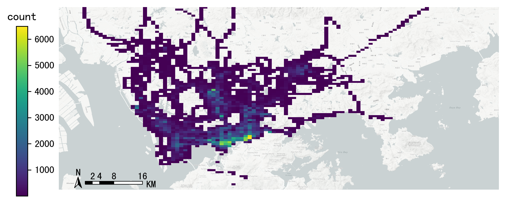
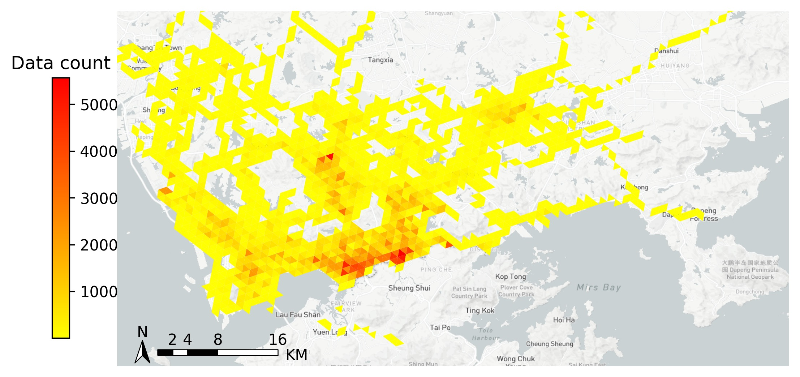
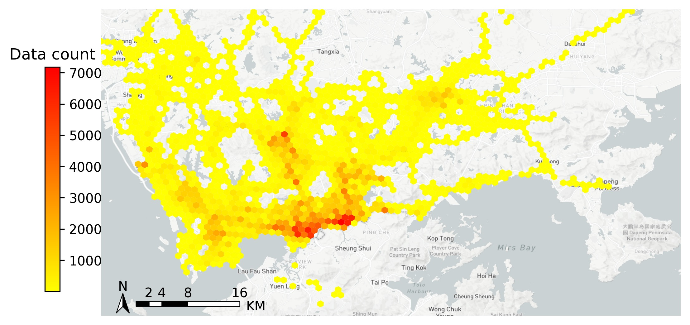

.. _grids:

***************
数据栅格化
***************

Gridding Framework
==============================

.. function:: transbigdata.area_to_grid(location, accuracy=500, method='rect', params='auto')

Generate the rectangular grids in the bounds or shape

**Parameters**

location : bounds(List) or shape(GeoDataFrame)
    Where to generate grids.
    If bounds, [lon1, lat1, lon2, lat2](WGS84), where lon1 , lat1 are the
    lower-left coordinates, lon2 , lat2 are the upper-right coordinates
    If shape, it should be GeoDataFrame
accuracy : number
    Grid size (meter)
method : str
    rect, tri or hexa
params : list or dict
    Gridding parameters. 
    See https://transbigdata.readthedocs.io/en/latest/grids.html 
    for detail information about gridding parameters.
    When Gridding parameters is given, accuracy will not be used.

**Returns**

grid : GeoDataFrame
    Grid GeoDataFrame,
    LONCOL and LATCOL are the index of grids,
    HBLON and HBLAT are the center of the grids
params : list or dict
    Gridding parameters. 
    See https://transbigdata.readthedocs.io/en/latest/grids.html 
    for detail information about gridding parameters.

.. function:: transbigdata.area_to_params(location, accuracy=500, method='rect')

Generate gridding params

**Parameters**

location : bounds(List) or shape(GeoDataFrame)
    Where to generate grids.
    If bounds, [lon1, lat1, lon2, lat2](WGS84), where lon1 , lat1 are the
    lower-left coordinates, lon2 , lat2 are the upper-right coordinates
    If shape, it should be GeoDataFrame
accuracy : number
    Grid size (meter)
method : str
    rect, tri or hexa

**Returns**

params : list or dict
    Gridding parameters. 
    See https://transbigdata.readthedocs.io/en/latest/grids.html 
    for detail information about gridding parameters.

.. function:: transbigdata.GPS_to_grid(lon, lat, params)

Match the GPS data to the grids. The input is the columns of
longitude, latitude, and the grids parameter. The output is the grid ID.

**Parameters**

lon : Series
    The column of longitude
lat : Series
    The column of latitude
params : list or dict
    Gridding parameters. 
    See https://transbigdata.readthedocs.io/en/latest/grids.html 
    for detail information about gridding parameters.

**Returns**

`Rectangle grids`
[LONCOL,LATCOL] : list
    The two columns LONCOL and LATCOL together can specify a grid.

`Triangle and Hexagon grids`
[loncol_1,loncol_2,loncol_3] : list
    The index of the grid latitude. The two columns LONCOL and
    LATCOL together can specify a grid.

.. function:: transbigdata.grid_to_centre(gridid, params)

The center location of the grid. The input is the grid ID and
parameters, the output is the grid center location.

**Parameters**

gridid : list
    if `Rectangle grids`
    [LONCOL,LATCOL] : Series
        The two columns LONCOL and LATCOL together can specify a grid.

    if `Triangle and Hexagon grids`
    [loncol_1,loncol_2,loncol_3] : Series
        The index of the grid latitude. The two columns LONCOL and
        LATCOL together can specify a grid.
params : list or dict
    Gridding parameters. 
    See https://transbigdata.readthedocs.io/en/latest/grids.html 
    for detail information about gridding parameters.

**Returns**

HBLON : Series
    The longitude of the grid center
HBLAT : Series
    The latitude of the grid center

.. function:: transbigdata.grid_to_polygon(gridid, params)

Generate the geometry column based on the grid ID.
The input is the grid ID, the output is the geometry.
Support rectangle, triangle and hexagon grids

**Parameters**

gridid : list
    if `Rectangle grids`
    [LONCOL,LATCOL] : Series
        The two columns LONCOL and LATCOL together can specify a grid.

    if `Triangle and Hexagon grids`
    [loncol_1,loncol_2,loncol_3] : Series
        The index of the grid latitude. The two columns LONCOL and
        LATCOL together can specify a grid.

params : list or dict
    Gridding parameters. 
    See https://transbigdata.readthedocs.io/en/latest/grids.html 
    for detail information about gridding parameters.

**Returns**

geometry : Series
    The column of grid geographic polygon

.. function:: transbigdata.grid_to_area(data, shape, params, col=['LONCOL', 'LATCOL'])

Input the two columns of grid ID, the geographic polygon and gridding
paramters. The output is the grid.

**Parameters**

data : DataFrame
    Data, with two columns of grid ID
shape : GeoDataFrame
    Geographic polygon
params : list or dict
    Gridding parameters. 
    See https://transbigdata.readthedocs.io/en/latest/grids.html 
    for detail information about gridding parameters.
col : List
    Column names [LONCOL,LATCOL] for rect grids or
    [loncol_1,loncol_2,loncol_3] for tri and hexa grids

**Returns**

data1 : DataFrame
    Data gridding and mapping to the corresponding geographic polygon
    
.. function:: transbigdata.grid_to_params(grid)

Regenerate gridding params from grid. Only support rect grids now.

**Parameters**

grid : GeoDataFrame
    grids generated by transbigdata

**Returns**

params : list or dict
    Gridding parameters. 
    See https://transbigdata.readthedocs.io/en/latest/grids.html 
    for detail information about gridding parameters.

Optimize gridding params
==============================

.. function:: transbigdata.grid_params_optimize(data,initialparams,col=['uid','lon','lat'],method='centerdist',printlog=False,sample=0)

Optimize the grid params

**Input**

data : DataFrame
    Trajectory data
initialparams : List
    Initial griding params
col : List
    Column names [uid,lon,lat]
method : str
    The method to optimize: centerdist, gini, gridscount
printlog : bool
    Whether to print log or not
sample : int
    Sample the data as input, if 0 it will not perform sampling
    
**Output**

params_optimized : List
    Optimized params

geohash编码
==============

geohash是一种公共域地理编码系统，它的作用是将经纬度地理位置编码为字母和数字组成的字符串，字符串也可解码为经纬度。每个字符串代表一个网格编号，字符串的长度越长则精度越高。根据\ `wiki <https://en.wikipedia.org/wiki/Geohash>`__\ ，geohash字符串长度对应精度表格如下：

========================= ======== ======== ========= ========= ========
geohash length(precision) lat bits lng bits lat error lng error km error
========================= ======== ======== ========= ========= ========
1                         2        3        ±23       ±23       ±2500
2                         5        5        ±2.8      ±5.6      ±630
3                         7        8        ±0.70     ±0.70     ±78
4                         10       10       ±0.087    ±0.18     ±20
5                         12       13       ±0.022    ±0.022    ±2.4
6                         15       15       ±0.0027   ±0.0055   ±0.61
7                         17       18       ±0.00068  ±0.00068  ±0.076
8                         20       20       ±0.000085 ±0.00017  ±0.019
========================= ======== ======== ========= ========= ========

TransBigData包中也提供了geohash的处理功能，主要包括三个函数：

.. function:: transbigdata.geohash_encode(lon,lat,precision=12)

输入经纬度与精度，输出geohash编码

**输入**

lon : Series
    经度列
lat : Series
    纬度列
precision : number
    geohash精度                       

**输出**

lon : Series
    经度列
lat : Series
    纬度列

.. function:: transbigdata.geohash_decode(geohash)

输入经纬度与精度，输出geohash编码

**输入**

geohash : Series
    geohash编码列                    

**输出**

geohash : Series
    geohash编码列

.. function:: transbigdata.geohash_togrid(geohash)

输入geohash编码，输出geohash网格的地理信息图形Series列

**输入**

geohash : Series
    geohash编码列                    

**输出**

poly : Series
    geohash的栅格列

相比TransBigData包中提供的方形栅格处理方法，geohash更慢，也无法提供自由定义的栅格大小。下面的示例展示如何利用这三个函数对数据进行geohash编码集计，并可视化

::

    import transbigdata as tbd
    import pandas as pd
    import geopandas as gpd
    #读取数据    
    data = pd.read_csv('TaxiData-Sample.csv',header = None) 
    data.columns = ['VehicleNum','time','slon','slat','OpenStatus','Speed'] 

::

    #依据经纬度geohash编码，精确度选6时，栅格大小约为±0.61km
    data['geohash'] = tbd.geohash_encode(data['slon'],data['slat'],precision=6)
    data['geohash']

.. parsed-literal::

    0         ws0btw
    1         ws0btz
    2         ws0btz
    3         ws0btz
    4         ws0by4
               ...  
    544994    ws131q
    544995    ws1313
    544996    ws131f
    544997    ws1361
    544998    ws10tq
    Name: geohash, Length: 544999, dtype: object

::

    #基于geohash编码集计
    dataagg = data.groupby(['geohash'])['VehicleNum'].count().reset_index()
    #geohash编码解码为经纬度
    dataagg['lon_geohash'],dataagg['lat_geohash'] = tbd.geohash_decode(dataagg['geohash'])
    #geohash编码生成栅格矢量图形
    dataagg['geometry'] = tbd.geohash_togrid(dataagg['geohash'])
    #转换为GeoDataFrame
    dataagg = gpd.GeoDataFrame(dataagg)
    dataagg

.. raw:: html

    

    
    <table border="1" class="dataframe">
      <thead>
        <tr style="text-align: right;">
          <th></th>
          <th>geohash</th>
          <th>VehicleNum</th>
          <th>lon_geohash</th>
          <th>lat_geohash</th>
          <th>geometry</th>
        </tr>
      </thead>
      <tbody>
        <tr>
          <th>0</th>
          <td>w3uf3x</td>
          <td>1</td>
          <td>108.</td>
          <td>10.28</td>
          <td>POLYGON ((107.99561 10.27771, 107.99561 10.283...</td>
        </tr>
        <tr>
          <th>1</th>
          <td>webzz6</td>
          <td>12</td>
          <td>113.9</td>
          <td>22.47</td>
          <td>POLYGON ((113.87329 22.46704, 113.87329 22.472...</td>
        </tr>
        <tr>
          <th>2</th>
          <td>webzz7</td>
          <td>21</td>
          <td>113.9</td>
          <td>22.48</td>
          <td>POLYGON ((113.87329 22.47253, 113.87329 22.478...</td>
        </tr>
        <tr>
          <th>3</th>
          <td>webzzd</td>
          <td>1</td>
          <td>113.9</td>
          <td>22.47</td>
          <td>POLYGON ((113.88428 22.46704, 113.88428 22.472...</td>
        </tr>
        <tr>
          <th>4</th>
          <td>webzzf</td>
          <td>2</td>
          <td>113.9</td>
          <td>22.47</td>
          <td>POLYGON ((113.89526 22.46704, 113.89526 22.472...</td>
        </tr>
        <tr>
          <th>...</th>
          <td>...</td>
          <td>...</td>
          <td>...</td>
          <td>...</td>
          <td>...</td>
        </tr>
        <tr>
          <th>2022</th>
          <td>ws1d9u</td>
          <td>1</td>
          <td>114.7</td>
          <td>22.96</td>
          <td>POLYGON ((114.68628 22.96143, 114.68628 22.966...</td>
        </tr>
        <tr>
          <th>2023</th>
          <td>ws1ddh</td>
          <td>6</td>
          <td>114.7</td>
          <td>22.96</td>
          <td>POLYGON ((114.69727 22.96143, 114.69727 22.966...</td>
        </tr>
        <tr>
          <th>2024</th>
          <td>ws1ddj</td>
          <td>2</td>
          <td>114.7</td>
          <td>22.97</td>
          <td>POLYGON ((114.69727 22.96692, 114.69727 22.972...</td>
        </tr>
        <tr>
          <th>2025</th>
          <td>ws1ddm</td>
          <td>4</td>
          <td>114.7</td>
          <td>22.97</td>
          <td>POLYGON ((114.70825 22.96692, 114.70825 22.972...</td>
        </tr>
        <tr>
          <th>2026</th>
          <td>ws1ddq</td>
          <td>7</td>
          <td>114.7</td>
          <td>22.98</td>
          <td>POLYGON ((114.70825 22.97241, 114.70825 22.977...</td>
        </tr>
      </tbody>
    </table>
    
2027 rows × 5 columns

    

::

    #设定绘图边界
    bounds = [113.6,22.4,114.8,22.9]
    #创建图框
    import matplotlib.pyplot as plt
    import plot_map
    fig =plt.figure(1,(8,8),dpi=280)
    ax =plt.subplot(111)
    plt.sca(ax)
    #添加地图底图
    tbd.plot_map(plt,bounds,zoom = 12,style = 4)
    #绘制colorbar
    cax = plt.axes([0.05, 0.33, 0.02, 0.3])
    plt.title('count')
    plt.sca(ax)
    #绘制geohash的栅格集计
    dataagg.plot(ax = ax,column = 'VehicleNum',cax = cax,legend = True)
    #添加比例尺和指北针
    tbd.plotscale(ax,bounds = bounds,textsize = 10,compasssize = 1,accuracy = 2000,rect = [0.06,0.03],zorder = 10)
    plt.axis('off')
    plt.xlim(bounds[0],bounds[2])
    plt.ylim(bounds[1],bounds[3])
    plt.show()

Old methods
=============================

.. function:: transbigdata.rect_grids(location,accuracy = 500,params='auto')

Generate the rectangular grids in the bounds or shape

**Parameters**

location : bounds(List) or shape(GeoDataFrame)
    Where to generate grids.
    If bounds, [lon1, lat1, lon2, lat2](WGS84), where lon1 , lat1 are the lower-left coordinates, lon2 , lat2 are the upper-right coordinates
    If shape, it should be GeoDataFrame
accuracy : number
    Grid size (meter)
params : List
    Gridding parameters (lonStart,latStart,deltaLon,deltaLat) or (lonStart,latStart,deltaLon,deltaLat,theta), lonStart and latStart are the lower-left coordinates; deltaLon, deltaLat are the length and width of a single grid; theta is the angle of the grid, it will be 0 if not given
    When Gridding parameters is given, accuracy will not be used.                          
                      

**Returns**

grid : GeoDataFrame
    Grid GeoDataFrame, LONCOL and LATCOL are the index of grids, HBLON and HBLAT are the center of the grids
params : List
    Gridding parameters (lonStart,latStart,deltaLon,deltaLat) or (lonStart,latStart,deltaLon,deltaLat,theta), lonStart and latStart are the lower-left coordinates; deltaLon, deltaLat are the length and width of a single grid; theta is the angle of the grid, it will be 0 if not given

::

    #设定范围
    bounds = [lon1,lat1,lon2,lat2]
    grid,params = tbd.rect_grids(bounds,accuracy = 500)

.. function:: transbigdata.grid_params(bounds,accuracy = 500)

栅格参数获取

**输入**

bounds : List
    生成范围的边界，[lon1,lat1,lon2,lat2] (WGS84坐标系) 其中，lon1,lat1是左下角坐标，lon2,lat2是右上角坐标 
accuracy : number
    栅格大小（米）
                                           

**输出**

params : List
    栅格参数(lonStart,latStart,deltaLon,deltaLat)，分别为栅格左下角坐标与单个栅格的经纬度长宽

::

    bounds = [113.75194,22.447837,114.624187,22.864748]
    tbd.grid_params(bounds,accuracy = 500)

.. function:: transbigdata.GPS_to_grids(lon,lat,params)

GPS数据对应栅格编号。输入数据的经纬度列与栅格参数，输出对应的栅格编号

**输入**

lon : Series
    经度列
lat : Series
    纬度列
params : List
    栅格参数(lonStart,latStart,deltaLon,deltaLat)，分别为栅格左下角坐标与单个栅格的经纬度长宽
                                           
**输出**

LONCOL : Series
    经度栅格编号列
LATCOL : Series
    纬度栅格编号列

::

    data['LONCOL'],data['LATCOL'] = tbd.GPS_to_grids(data['Lng'],data['Lat'],params)

.. function:: transbigdata.grids_centre(loncol,latcol,params)

栅格编号对应栅格中心点经纬度。输入数据的栅格编号与栅格参数，输出对应的栅格中心点

**输入**

LONCOL : Series
    经度栅格编号列
LATCOL : Series
    纬度栅格编号列
params : List
    栅格参数(lonStart,latStart,deltaLon,deltaLat)，分别为栅格左下角坐标与单个栅格的经纬度长宽
                                           
**输出**

HBLON : Series
    栅格中心点经度列
HBLAT : Series
    栅格中心点纬度列

::

    data['HBLON'],data['HBLAT'] = tbd.grids_centre(data['LONCOL'],data['LATCOL'],params)

.. function:: transbigdata.gridid_to_polygon(loncol,latcol,params)

栅格编号生成栅格的地理信息列。输入数据的栅格编号与栅格参数，输出对应的地理信息列

**输入**

LONCOL : Series
    经度栅格编号列
LATCOL : Series
    纬度栅格编号列
params : List
    栅格参数(lonStart,latStart,deltaLon,deltaLat)，分别为栅格左下角坐标与单个栅格的经纬度长宽
                                           
**输出**

geometry : Series
    栅格的矢量图形列

::

    data['geometry'] = tbd.gridid_to_polygon(data['LONCOL'],data['LATCOL'],params)

.. function:: transbigdata.gridid_sjoin_shape(data,shape,params,col = ['LONCOL','LATCOL'])

输入数据（带有栅格经纬度编号两列），矢量图形与栅格化参数，输出数据栅格并对应矢量图形。

**输入**

data : DataFrame
    数据,（带有栅格经纬度编号两列）
shape : GeoDataFrame
    矢量图形
params : List
    栅格化参数
col : List
    列名，[经度栅格编号，纬度栅格编号]

**输出**

data1 : DataFrame
    数据栅格并对应矢量图形

.. function:: transbigdata.regenerate_params(grid)

Regenerate gridding params from grid.

**Input**
grid : GeoDataFrame
    grids generated by transbigdata 
                                            

**Output**
params : List
    Gridding parameters (lonStart,latStart,deltaLon,deltaLat) or (lonStart,latStart,deltaLon,deltaLat,theta), lonStart and latStart are the lower-left coordinates; deltaLon, deltaLat are the length and width of a single grid; theta is the angle of the grid, it will be 0 if not given

.. function:: transbigdata.GPS_to_grids_tri(lon, lat, params)

Match the GPS data to the Triangle grids. The input is the columns of
longitude, latitude, and the grids parameter. The output is the grid ID.

**Parameters**

lon : Series
    The column of longitude
lat : Series
    The column of latitude
params : List
    Gridding parameters (lonStart, latStart, deltaLon, deltaLat) or
    (lonStart, latStart, deltaLon, deltaLat, theta).
    lonStart and latStart are the lower-left coordinates;
    deltaLon, deltaLat are the length and width of a single grid;
    theta is the angle of the grid, it will be 0 if not given.
    When Gridding parameters is given, accuracy will not be used.

**Returns**

gridid : Series
    The index of the triangle grid.

.. function:: transbigdata.gridid_to_polygon_tri(gridid, params)

Generate the geometry column based on the Triangle grid ID.
The input is the grid ID, the output is the geometry.

**Parameters**

gridid : Series
    The index of the triangle grid.
params : List
    Gridding parameters (lonStart, latStart, deltaLon, deltaLat) or
    (lonStart, latStart, deltaLon, deltaLat, theta).
    lonStart and latStart are the lower-left coordinates;
    deltaLon, deltaLat are the length and width of a single grid;
    theta is the angle of the grid, it will be 0 if not given.
    When Gridding parameters is given, accuracy will not be used.

**Returns**

geometry : Series
    The column of grid geographic polygon

::

    
    #Map the GPS data to triangle grids
    data['gridid'] = tbd.GPS_to_grids_tri(data['lon'],data['lat'],params)
    #Generate grid geometry
    grid_agg['geometry'] = tbd.gridid_to_polygon_tri(grid_agg['gridid'],params)

.. function:: transbigdata.GPS_to_grids_hexa(lon, lat, params)

Match the GPS data to the Hexagon grids. The input is the columns of
longitude, latitude, and the grids parameter. The output is the grid ID.

**Parameters**

lon : Series
    The column of longitude
lat : Series
    The column of latitude
params : List
    Gridding parameters (lonStart, latStart, deltaLon, deltaLat) or
    (lonStart, latStart, deltaLon, deltaLat, theta).
    lonStart and latStart are the lower-left coordinates;
    deltaLon, deltaLat are the length and width of a single grid;
    theta is the angle of the grid, it will be 0 if not given.
    When Gridding parameters is given, accuracy will not be used.

**Returns**

gridid : Series
    The index of the hexagon grid.

.. function:: transbigdata.gridid_to_polygon_hexa(gridid, params)

Generate the geometry column based on the Hexagon grids ID.
The input is the grid ID, the output is the geometry.

**Parameters**

gridid : Series
    The index of the hexagon grid.
params : List
    Gridding parameters (lonStart, latStart, deltaLon, deltaLat) or
    (lonStart, latStart, deltaLon, deltaLat, theta).
    lonStart and latStart are the lower-left coordinates;
    deltaLon, deltaLat are the length and width of a single grid;
    theta is the angle of the grid, it will be 0 if not given.
    When Gridding parameters is given, accuracy will not be used.

**Returns**

geometry : Series
    The column of grid geographic polygon

::

    
    #Map the GPS data to hexagon grids
    data['gridid'] = tbd.GPS_to_grids_hexa(data['lon'],data['lat'],params)
    #Generate grid geometry
    grid_agg['geometry'] = tbd.gridid_to_polygon_hexa(grid_agg['gridid'],params)

