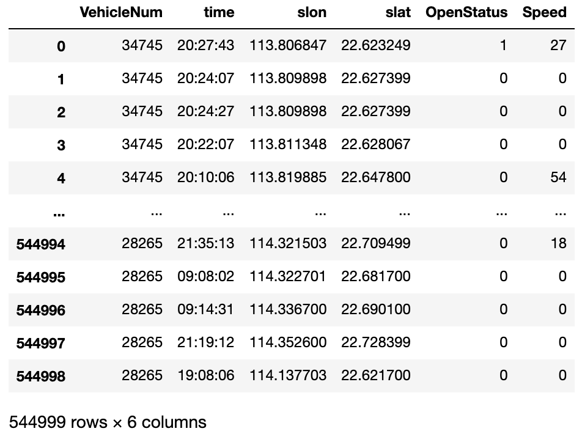
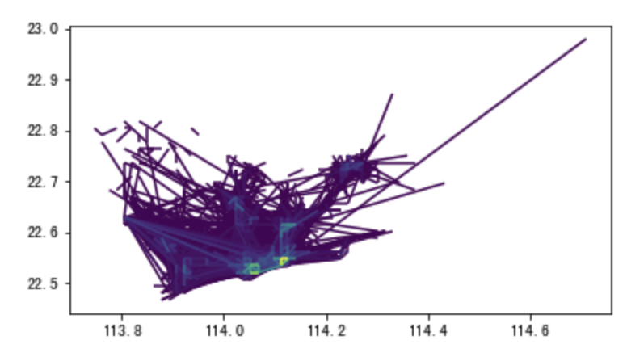

.. transbigdata documentation master file, created by
   sphinx-quickstart on Thu Oct 21 14:41:25 2021.
   You can adapt this file completely to your liking, but it should at least
   contain the root `toctree` directive.

TransBigData 为交通时空大数据而生
========================================

**主要功能**

TransBigData工具针对时空大数据处理而开发，依托于GeoPandas。TransBigData集成了交通时空大数据处理过程中常用的方法。包括栅格化、数据质量分析、数据预处理、数据集计、轨迹分析、GIS处理、地图底图加载、坐标与距离计算、数据可视化等通用方法。TransBigData也针对出租车GPS数据、共享单车数据、公交GPS数据等多种常见交通时空大数据提供了快速简洁的处理方法。

**Target audience**

The target audience of `TransBigData` includes: 

- Data science researchers and data engineers in the field of transportation big data, smart transportation systems and urban computing, particularly those who want to integrate innovative algorithms into the intelligent trasnportation systems.
- Government, enterprises, or other entities who expect efficient and reliable management decision support through transportation spatio-temporal data analysis.

**技术特点**

* 面向交通时空大数据分析不同阶段的处理需求提供不同处理功能。
* 代码简洁、高效、灵活、易用，通过简短的代码即可实现复杂的数据任务。

TransBigData简介
==============================

快速入门
---------------

| 在安装TransBigData之前，请确保已经安装了可用的geopandas包：https://geopandas.org/index.html
| 如果你已经安装了geopandas，则直接在命令提示符中运行下面代码即可安装

::

    pip install -U transbigdata

下面例子展示如何使用TransBigData工具快速地从出租车GPS数据中提取出行OD::

    #Import TransBigData
    import transbigdata as tbd
    #Read the data    
    import pandas as pd
    data = pd.read_csv('TaxiData-Sample.csv',header = None) 
    data.columns = ['VehicleNum','time','slon','slat','OpenStatus','Speed'] 
    data

使用tbd.taxigps_to_od方法，传入对应的列名，即可提取出行OD::

    #Extract OD from GPS data
    oddata = tbd.taxigps_to_od(data,col = ['VehicleNum','time','slon','slat','OpenStatus'])
    oddata

.. image:: _static/WX20211021-190104@2x.png
   :height: 300

对提取出的OD进行OD的栅格集计::

    #define bounds
   bounds = [113.6,22.4,114.8,22.9]
   #obtain the gridding parameters
   params = tbd.grid_params(bounds = bounds,accuracy = 1500)
   #gridding OD data and aggregate
   od_gdf = tbd.odagg_grid(oddata,params)
   od_gdf.plot(column = 'count')

Example gallery
---------------
.. raw:: html
   :file: gallery/html/grid.html

相关链接
---------------

* 小旭学长的b站： https://space.bilibili.com/3051484
* 小旭学长的七天入门交通时空大数据分析课程（零基础免费课）： https://www.lifangshuju.com/#/introduce/166  
* 小旭学长的交通时空大数据分析课程： https://www.lifangshuju.com/#/introduce/154  
* 小旭学长的数据可视化课程： https://www.lifangshuju.com/#/introduce/165  
* 本项目的github页面： https://github.com/ni1o1/transbigdata/  
* 有bug请在这个页面提交： https://github.com/ni1o1/transbigdata/issues

安装、依赖与更新日志
=========================

.. toctree::
   :caption: 安装、依赖与更新日志
   :maxdepth: 2
   
   getting_started.rst

使用示例
=========================

.. toctree::
   :caption: 使用示例
   :maxdepth: 2

   example-taxi/example-taxi.rst
   example-busgps/example-busgps.rst
   metromodel/metromodel.rst
   Example-pNEUMA/Example-pNEUMA.rst
   example-bikesharing/example-bikesharing.rst

通用方法
=========================

.. toctree::
   :caption: 通用方法
   :maxdepth: 2
   
   quality.rst
   preprocess.rst
   grids.rst
   odprocess.rst
   visualization.rst
   traj.rst
   gisprocess.rst
   plot_map.rst
   CoordinatesConverter.rst
   getbusdata.rst

各类数据处理方法
=========================

.. toctree::
   :caption: 各类数据处理方法
   :maxdepth: 2

   taxigps.rst
   bikedata.rst
   busgps.rst
   metroline.rst

